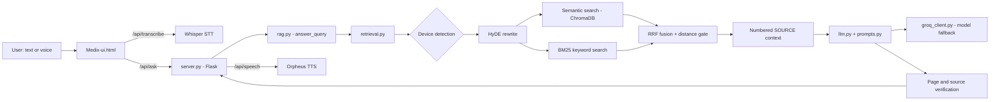

# Medix — AI Maintenance Assistant for Medical Equipment

**Medix** (formerly *Fixora*) is a voice-enabled, retrieval-augmented assistant that helps biomedical technicians troubleshoot medical equipment. Ask a question by text or voice ("The ventilator has a power supply problem") and Medix answers **only from the indexed service manuals**, citing the exact page and section for every claim. When the manuals do not contain an answer, it says so instead of guessing.

> **Why it matters:** in a safety-critical domain, a fluent but invented repair step is worse than no answer. Medix is designed around *grounded answers first*: every statement must be traceable to a retrieved manual passage, and the system is evaluated automatically for hallucinations.

---

## Highlights

| | |
|---|---|
| **100%** | Overall hallucination-free answers (8/8) on the evaluation suite |
| **100%** | SOURCE-citation grounding (8/8) |
| **100%** | Malfunction → action grounding (8/8) |
| **87.5%** | Answer fact-match accuracy (7/8) |

See [Evaluation](#evaluation) for methodology, history, and limitations.

## Key features

- **Hybrid retrieval** combining dense semantic search (ChromaDB + `all-MiniLM-L6-v2`), BM25 keyword search, and **HyDE** query rewriting, fused with weighted **Reciprocal Rank Fusion**.
- **Automatic device detection** across many manuals; near-ties search several manuals and the answer states that more than one device may match.
- **Grounded generation** with a strict system prompt: no invented steps, no action attached to the wrong malfunction, no facts from outside the retrieved evidence, explicit match levels (*Direct match / Closest entries / Not found*).
- **Answer verification**: page numbers cited by the model are checked against the retrieved context and the answer is retried or flagged when they do not match.
- **Voice mode**: continuous speech conversation (Whisper speech-to-text, Orpheus text-to-speech) with an animated orb; it stays open until the user presses *Done* or says *thanks*.
- **Ask about your own file**: upload a PDF / TXT / DOCX and ask questions about it using the same grounded pipeline.
- **Multi-model resilience**: per-model rate-limit handling with automatic fallback between Groq models.
- **Conversation history and export** (local browser storage, export to Word, copy as text), light and dark themes.
- **Built-in evaluation harness** that measures retrieval and hallucination metrics.

## Architecture



**Request flow**

1. `retrieval.py` probes the whole corpus with the raw query to decide which manual(s) are relevant. If nothing is close enough (cosine distance > 0.5) the query is answered as *not found*.
2. The query is rewritten by HyDE into manual-style wording, then searched three ways (raw query with synonym expansion, HyDE rewrite, BM25) inside the selected device(s).
3. Results are fused with RRF (weights 1.5 / 1.0 / 1.0, k = 60). A BM25 rescue keeps strong keyword matches that embeddings rank poorly.
4. The top chunks are formatted as numbered `SOURCE n` blocks (device, page, section, distance, text).
5. `llm.py` sends them with the grounding prompt to a Groq model, parses the JSON answer (display text and a short spoken version), and verifies cited pages.
6. `server.py` returns the answer; voice replies are converted to speech on demand.

## Tech stack

| Layer | Technology |
|---|---|
| Backend | Python, Flask |
| LLM / STT / TTS | Groq API: `openai/gpt-oss-120b` and `gpt-oss-20b` (answers, HyDE), `whisper-large-v3-turbo` (STT), `canopylabs/orpheus-v1-english` (TTS) |
| Embeddings | `sentence-transformers/all-MiniLM-L6-v2` |
| Vector store | ChromaDB (cosine) |
| Keyword search | `rank_bm25` |
| PDF processing | PyMuPDF, pdfplumber, Tesseract OCR (for scanned manuals) |
| Frontend | Vanilla JS, Tailwind CDN, Canvas (animated orb), `marked` |

## Project structure and what each file does

| File | Responsibility |
|---|---|
| `server.py` | Flask application. Serves the UI and exposes the REST API: Q&A, file Q&A, speech-to-text, text-to-speech. Handles closing phrases ("thanks", "bye") and repairs the streamed WAV header. |
| `Medix-ui.html` | Single-page chat interface: conversation history, voice-mode overlay with the animated orb, file attachment, theme toggle, chat export. |
| `retrieval.py` | The retrieval engine: embedding search, BM25 index, HyDE rewrite, synonym expansion, RRF fusion, distance gating, multi-device selection, exact error-code lookup, vector-database creation. |
| `rag.py` | Orchestrates one question end to end: calls retrieval, builds the numbered SOURCE context, calls the generator, and returns the answer with its context. |
| `llm.py` | Answer generation: sends the prompt, parses the JSON reply, cleans and shortens the spoken answer for TTS, verifies that cited pages exist in the context, and retries or flags unsupported answers. |
| `prompts.py` | The system and user prompts. Encodes the safety rules: use only the evidence, attach each action to its own malfunction, handle flattened tables and missing context, never present a vague query as a direct match. |
| `groq_client.py` | Shared Groq client. Discovers the models available to the account, applies per-model cool-downs on rate limits, falls back between models, and supports forcing a single model via `FIXORA_MODEL` for fair tests. |
| `preprocessing.py` | Turns PDF manuals into chunks: text extraction (PyMuPDF → pdfplumber → OCR), device-specific parsers for troubleshooting tables (Servo, Philips G40, SC6002XL), sentence-aware chunking with context carry-over, optional hand-checked overrides, validation, and JSON export. |
| `normalize_chunks.py` | One-time pass that rewrites differently worded fault tables into a common `Malfunction / Action` form before embedding. |
| `build_inventory.py` | Scans the manuals folder and produces `device_inventory.json` (device id, name, manufacturer). |
| `device_inventory.json` | Metadata for every manual in the corpus. |
| `manual_overrides.json` *(optional)* | Hand-verified troubleshooting rows that replace auto-parsed rows for pages where the PDF table cannot be reconstructed reliably. |
| `config.py` | Paths and the registry of specialised manuals (`MANUALS`, `MANUALS_DIR`, `PROCESSED_DIR`, `VECTOR_DB_DIR`). |
| `evaluate.py` | Automated evaluation: retrieval accuracy plus answer-level grounding and hallucination checks. |
| `.env` | `GROQ_API_KEY` (never commit this file). |

## Getting started

### Prerequisites

- Python 3.10 or newer
- A [Groq API key](https://console.groq.com)
- (Optional) [Tesseract OCR](https://github.com/tesseract-ocr/tesseract) for scanned PDFs
- Your service-manual PDFs (check licensing before redistributing them)

### Installation

```powershell
git clone https://github.com/ashmousaXX/Medix-AI-Maintenance-Assistant.git
cd Medix-AI-Maintenance-Assistant

python -m venv .venv
.venv\Scripts\Activate.ps1          # Linux/macOS: source .venv/bin/activate

pip install flask python-dotenv groq chromadb sentence-transformers rank-bm25 `
            pymupdf pdfplumber pytesseract pillow python-docx
```

Create a `.env` file:

```env
GROQ_API_KEY=your_key_here
```

### Build the knowledge base

```powershell
python build_inventory.py        # 1. scan manuals -> device_inventory.json
python preprocessing.py          # 2. extract and chunk the manuals
python normalize_chunks.py       # 3. unify fault-table wording
python -c "from retrieval import create_vector_database; create_vector_database()"   # 4. embed and index
```

### Run

```powershell
python server.py
```

Open <http://127.0.0.1:5000>.

## API reference

| Method | Endpoint | Description |
|---|---|---|
| `GET` | `/` | Web interface |
| `GET` | `/api/health` | Health check |
| `POST` | `/api/ask` | `{ "query": "..." }` → `answer`, `speech_answer`, `device`, `retrieval_type` |
| `POST` | `/api/ask_file` | Multipart form (`query`, `file`) → answer grounded in the uploaded PDF/TXT/DOCX |
| `POST` | `/api/transcribe` | Multipart audio → `{ "text": "..." }` |
| `POST` | `/api/speech` | `{ "text": "..." }` → WAV audio |

## Evaluation

`evaluate.py` runs a fixed suite of **8 test queries** across three devices (Servo Ventilator 900 C/D/E, Philips V24/V25 Agilent M1205 monitor, Siemens SC 6002XL monitor) plus **one negative query** that the system must refuse ("How do I repair a home coffee machine?"). The checks are fully automatic:

| Metric | What it measures |
|---|---|
| Device accuracy | Whether the correct manual was selected |
| Retrieval type accuracy | `semantic` for in-scope questions, `not_found` for out-of-scope ones |
| Answer fact-match | Whether the answer contains the expected key terms from the manual |
| SOURCE grounding | Whether every cited `SOURCE n` exists in the retrieved context (no invented citations) |
| Malfunction/action grounding | Whether the stated fault and its action are supported by the cited source, and the action belongs to that fault |
| Hallucination-free answers | Answers passing **all** grounding checks |

### Final results

```
================================================================================
ANSWER SUMMARY
Evaluated answers: 8
Answer fact-match accuracy: 87.5%
SOURCE grounding accuracy: 100.0%
Malfunction/action grounding accuracy: 100.0%
Overall hallucination-free answers: 100.0%
================================================================================
```

| Metric | Result |
|---|---|
| Answer fact-match accuracy | **87.5%** (7/8) |
| SOURCE grounding accuracy | **100%** (8/8) |
| Malfunction/action grounding accuracy | **100%** (8/8) |
| Overall hallucination-free answers | **100%** (8/8) |

### Progress during development

The numbers below come from the evaluation runs recorded during the project; each row corresponds to a meaningful change in the system.

| Iteration | Main change | Fact-match | SOURCE grounding | Action grounding | Hallucination-free |
|---|---|---|---|---|---|
| 1. Baseline | Hybrid retrieval + HyDE, single answer model, fixed-delay retries | 87.5% | 100% | 75.0% | 75.0% |
| 2. Resilient LLM layer + new prompt | Multi-model fallback, per-model rate-limit cool-downs, three match levels, grounding rules | 100% | 100% | 87.5% | 87.5% |
| 3. Chunking and multi-device search | Sentence overlap in chunks, multi-device probing | 87.5% | 100% | 75.0% | 75.0% |
| 4. Final | Conditional chunk overlap, fixed Servo table parser, stricter prompt and verification | **87.5%** | **100%** | **100%** | **100%** |

Retrieval accuracy (correct device and correct retrieval type) was **100% (8/8)** in the baseline and iteration 2 runs. Iteration 3 exposed a device-selection regression (87.5%) caused by the chunk-overlap change; it was diagnosed from raw distance traces and fixed in iteration 4.

**What the iterations taught us**

- *Most hallucinations were data problems, not model problems.* Flattened PDF tables separated malfunctions from their actions; the model then paired them wrongly. Fixing the parser and instructing the model not to assign actions when the pairing is ambiguous removed the errors.
- *Context fragments cause misreadings.* A chunk that started with "If it is good, replace the Power Supply Assembly" made the model guess what "it" meant. Carrying over the previous sentence only where a sentence depends on it fixed this without hurting retrieval.
- *Rate limits shape architecture.* Groq's per-model token limits led to the shared client with fallback, smaller completion budgets, and a HyDE model separate from the answer model.

### Limitations (please read)

- The suite contains **8 queries**, so one query equals 12.5 percentage points. The figures show that the system behaves correctly on the cases it was tuned against; they are **not** a statistically powered estimate of real-world accuracy. Expanding the suite to 50+ queries per device is the first roadmap item.
- Grounding checks are lexical (word overlap and structure), so they cannot detect every semantic error, for example an action quoted from the correct page but assigned to the wrong row of a flattened table. Hand-verified overrides are used for such pages.
- The evaluation counts a failed LLM call (rate limit) as *skipped*, not as a quality failure.
- Answer quality depends on the answering model; results were obtained with the Groq `gpt-oss` models listed above.

## Roadmap

- Larger, per-device evaluation set with human-reviewed gold answers
- Table-aware extraction for all troubleshooting sections (replacing manual overrides)
- Cross-encoder re-ranking
- Streaming answers and multi-turn memory
- Authentication and per-technician history

## Safety notice

Medix is a decision-support tool. Always verify instructions against the official manual and follow your organisation's procedures and the manufacturer's safety warnings before servicing medical equipment. Medix does not replace a qualified biomedical engineer.

## Authors

- Shrouk Wael — Computer Science (AI & Robotics Software), Helwan National University
- *Add teammates here*

## License

*Add a license (for example MIT) and note the licensing terms of any service manuals you use.*
