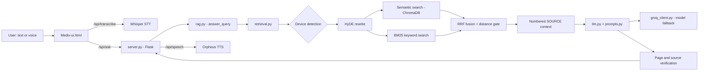

# Medix: AI Maintenance Assistant for Medical Equipment


**Medix** (formerly *Fixora*) is a voice-enabled, retrieval-augmented assistant that helps biomedical technicians troubleshoot medical equipment. A technician asks by text or voice ("The ventilator has a power supply problem") and Medix answers **only from the indexed service manuals**, citing the page and section of every claim. When the manuals do not contain an answer, it says so instead of guessing.

> **Why it matters.** In a safety-critical domain, a fluent but invented repair step is worse than no answer. Medix is built around *grounded answers first*: every statement must be traceable to a retrieved manual passage, and the system is evaluated automatically for hallucinations.

Developed over three months and validated against a fixed evaluation suite after every significant change.

---

## Highlights

| Metric (8-query evaluation suite) | Result |
|---|---|
| Overall hallucination-free answers | **100%** (8/8) | 
| SOURCE-citation grounding | **100%** (8/8) | 
| Malfunction → action grounding | **100%** (8/8) | 
| Answer fact-match accuracy | **87.5%** (7/8) | 
| Device identification accuracy | **100%** (8/8) |
| Retrieval-type accuracy (semantic / not found) | **100%** (8/8) | 

Intervals are exact . With only eight queries they are wide on purpose: see [Evaluation](#evaluation) for what these numbers do and do not show.

## Key features

- **Hybrid retrieval.** Dense semantic search (ChromaDB with `all-MiniLM-L6-v2`), BM25 keyword search and **HyDE** query rewriting, fused with weighted Reciprocal Rank Fusion. A bounded BM25 "rescue" keeps strong keyword matches that embeddings rank poorly.
- **Automatic device detection.** The user never has to name the equipment; when two manuals are almost equally plausible, both are searched and the answer says that more than one device may match.
- **Exact error-code lookup.** Numeric fault codes go straight to the manual's error table, with filtering that stops page, section and revision numbers from being mistaken for codes.
- **Grounded generation.** A strict system prompt forbids facts from outside the retrieved evidence, forbids attaching an action to the wrong malfunction, and requires one of three explicit match levels: *Direct match*, *Closest entries* or *Not found*. Extra rules cover flattened PDF tables and sentences whose context was cut off.
- **Answer verification.** Page numbers cited by the model are checked against the retrieved context. An unsupported citation triggers a corrective re-generation, and if it persists the answer is flagged to the user.
- **Voice interaction.** Speech-to-text with Whisper, spoken answers, and a voice-mode overlay with an animated orb. The assistant answers a closing phrase ("thanks", "bye") without a model call.
- **Ask about your own file.** Upload a PDF, TXT or DOCX and ask questions about it through the same grounded prompt.
- **Multi-model resilience.** Per-model rate-limit cool-downs and automatic fallback between Groq models, so one rate limit does not fail a request.
- **Built-in evaluation harness** that reports retrieval accuracy and automatic hallucination checks.

## Architecture




## Evaluation

`evaluate.py` runs a fixed suite of **eight queries** over three devices plus one negative case:

| # | Device | Query topic |
|---|---|---|
| 1–4 | Servo Ventilator 900 C/D/E | inspiratory flow transducer, gas supply, power supply, pressure |
| 5–6 | Philips V24/V25 Agilent M1205 monitor | blank screen, power supply |
| 7 | Siemens SC 6002XL patient monitor | display malfunction (missing areas, wrong colours) |
| 8 | *Negative case* | "How do I repair a home coffee machine?" (must return *not found*) |

### What is measured

| Metric | Definition |
|---|---|
| Device accuracy | The correct manual was selected. |
| Retrieval-type accuracy | `semantic` for in-scope questions, `not_found` for the out-of-scope one. |
| Answer fact-match | The answer contains the expected key terms from the manual. |
| SOURCE grounding | Every cited `SOURCE n` exists in the retrieved context (no invented citations). |
| Malfunction/action grounding | The stated fault and its action are supported by the cited source, and the action belongs to that fault. |
| Hallucination-free | The answer passes all grounding checks. |

Calls that fail because of an API rate limit are reported as *skipped* and are not counted as quality failures.

### Final results

```
================================================================================
ANSWER SUMMARY
Evaluated answers: 8
Answer fact-match accuracy: 87.5%
SOURCE grounding accuracy: 100.0%
Malfunction/action grounding accuracy: 100.0%
Overall hallucination-free answers: 100.0%
================================================================================
```

The remaining fact-match miss is an expected-term check (the answer did not contain every expected term from the manual). It is independent of the grounding checks, all of which passed for all eight answers.

### Progress across the last evaluation runs

| Run | Main change | Fact-match | SOURCE grounding | Action grounding | Hallucination-free |
|---|---|---|---|---|---|
| 1 | Match-level prompt, single preferred model with fallback. The preferred model's per-minute output limit rejected requests, so one query was skipped. | 85.7% (6/7) | 100% | 85.7% | 85.7% |
| 2 | `gpt-oss-120b` / `gpt-oss-20b` fallback chain, citation format `(Source N, Page X)`, stricter rule for "related entries" | 100% (8/8) | 100% | 87.5% | 87.5% |
| 3 (final) | Prompt rules for flattened tables and truncated context, final data-pipeline tuning | 87.5% (7/8) | 100% | **100%** | **100%** |

Retrieval accuracy (device and retrieval type) was 100% in every run; the changes above improved *answer quality*, not retrieval.

### What the iterations taught us

- **Most apparent hallucinations were data problems, not model problems.** PDF tables converted to plain text lose the link between each malfunction and its action; the model then paired them wrongly even though every word came from the manual. Parsing tables row by row, and telling the model not to assign actions when the pairing is unclear, removed most of these errors.
- **Truncated context causes misreadings.** A chunk that started with "If it is good, replace the Power Supply Assembly" made the model guess what "it" meant. The prompt now requires such sentences to be quoted as written, with a note that the preceding text is missing.
- **Rate limits shape the design.** Per-model token limits led to the shared Groq client with fallback, smaller completion budgets, and a separate model for HyDE.
- **A good score on a small suite is a regression check, not a guarantee.** See the limitations below.

### Limitations

- The suite has **eight queries**, so one query equals 12.5 percentage points and the confidence intervals above are wide. The figures show that the system behaves correctly on the cases it was tuned against; they are **not** a statistically powered estimate of real-world accuracy. Growing the suite to 50+ queries per device is the first roadmap item.
- Grounding checks are lexical and structural. They cannot detect every semantic error, for example an action copied from the correct page but assigned to the wrong row of a flattened table.
- Answer quality depends on the answering model; the results were obtained with the Groq `gpt-oss` models listed below.
- Scanned manuals depend on OCR quality, and their tables cannot always be reconstructed row by row.

## Tech stack

| Layer | Technology |
|---|---|
| Backend | Python, Flask |
| LLM | Groq API: `openai/gpt-oss-120b` (answers) with `openai/gpt-oss-20b` fallback; `gpt-oss-20b` first for HyDE |
| Speech-to-text | Groq `whisper-large-v3-turbo` |
| Text-to-speech | `edge-tts` (neural voice, MP3, cached on disk) |
| Embeddings | `sentence-transformers/all-MiniLM-L6-v2` |
| Vector store | ChromaDB (cosine distance) |
| Keyword search | `rank_bm25` |
| PDF processing | PyMuPDF, pdfplumber, Tesseract OCR (scanned manuals) |
| Frontend | Vanilla JavaScript, Tailwind CSS |

## Project structure

### Application

| File | Responsibility |
|---|---|
| `server.py` | Flask application and entry point. Serves the UI and the REST API (question answering, file Q&A, speech-to-text, text-to-speech), handles closing phrases and caches generated speech in `tts_cache/`. |
| `Medix-ui.html` | Single-page web interface: chat, conversation history, voice-mode overlay, file attachment, light/dark themes. |
| `rag.py` | Runs one question end to end: calls retrieval, builds the numbered `SOURCE` context and calls the generator. |
| `retrieval.py` | Retrieval engine: embedding search, BM25 index, HyDE rewrite, synonym expansion, RRF fusion, distance gating, device detection (including near-ties), exact error-code lookup and vector-database creation. |
| `llm.py` | Answer generation: calls the model, parses the JSON reply, cleans and shortens the spoken answer, verifies cited pages and retries or flags unsupported answers. |
| `prompts.py` | System and user prompts that encode the grounding and safety rules. |
| `groq_client.py` | Shared Groq client: discovers the models available to the account, applies per-model cool-downs on rate limits, falls back between models, and can be pinned to one model with the `FIXORA_MODEL` environment variable for reproducible tests. |
| `config.py` | Paths (`MANUALS_DIR`, `PROCESSED_DIR`, `VECTOR_DB_DIR`) and the registry of manuals that have specialised parsers. |

### Data preparation

| File | Responsibility |
|---|---|
| `build_inventory.py` | Scans the manuals folder and writes the device inventory (`Data/device_inventory.json`: stable device id, name, manufacturer). |
| `preprocessing.py` | Converts PDF manuals into retrieval-ready chunks: text extraction (PyMuPDF, then pdfplumber, then OCR), specialised troubleshooting-table parsers for the Servo, Philips G40 and SC 6002XL manuals, sentence-aware generic chunking, error-code detection with false-positive filtering, validation and JSON export. |
| `normalize_chunks.py` | One-time pass that rewrites differently worded fault tables (for example SC 6002XL "Symptom or condition / Troubleshooting and remedial action") into the common `Malfunction / Action` form before embedding. |

### Evaluation

| File | Responsibility |
|---|---|
| `evaluate.py` | Retrieval and answer evaluation harness that produces the results above. |

### Development utilities (not needed to run Medix)

`xx.py`, `debug_voltage.py`, `test_tts.py`, `Voice.py`, `app.py` and `servo_ocr_debug.txt` are scratch scripts and debug dumps kept from development (retrieval-distance probes, text-to-speech tests, an early voice prototype and an OCR dump used to design the Servo table parser).

### Generated at runtime (not committed)

| Path | Content |
|---|---|
| `data_processed/maintai_chunks.json` | Chunks produced by `preprocessing.py`. |
| `vector_db/` | Persistent ChromaDB index. |
| `tts_cache/` | Cached speech files. |
| `.env` | Your `GROQ_API_KEY`. Never commit this file. |

## Getting started

### Prerequisites

- Python 3.10 or newer
- A [Groq API key](https://console.groq.com)
- [Tesseract OCR](https://github.com/tesseract-ocr/tesseract) (only needed for scanned PDFs)
- Your own copies of the service manuals (see the note on manuals below)

### Install

```powershell
git clone https://github.com/ashmousaXX/Medix-AI-Maintenance-Assistant.git
cd Medix-AI-Maintenance-Assistant

python -m venv .venv
.venv\Scripts\Activate.ps1            # Linux/macOS: source .venv/bin/activate

pip install -r requirements.txt
```

Create a `.env` file (see `.env.example`):

```env
GROQ_API_KEY=your_key_here
```

### Add the manuals

Service manuals are third-party copyrighted documents and are **not distributed with this repository**. Place your own licensed PDFs in `Data/Maintencie/` (the folder configured in `config.py`) and register any manual that has a specialised parser in `config.py`.

### Build the knowledge base

```powershell
python build_inventory.py        # 1. scan manuals -> Data/device_inventory.json
python preprocessing.py          # 2. extract and chunk the manuals
python normalize_chunks.py       # 3. unify fault-table wording
python -c "from retrieval import create_vector_database; create_vector_database()"   # 4. embed and index
```

Repeat these steps whenever a manual is added or changed.

### Run

```powershell
python server.py
```

Open <http://127.0.0.1:5000>.

### Reproduce the evaluation

```powershell
python evaluate.py
```

To compare models fairly, pin a single answer model for the run:

```powershell
$env:FIXORA_MODEL = "openai/gpt-oss-120b"
python evaluate.py
```

Groq's free tier limits tokens per minute per model, so the answer evaluation may need a pause between queries.

## API reference

| Method | Endpoint | Description |
|---|---|---|
| `GET` | `/` | Web interface |
| `GET` | `/api/health` | Health check: `{ "status": "ok" }` |
| `POST` | `/api/ask` | JSON `{ "query": "..." }` (max 1000 characters). Returns `answer`, `speech_answer`, `device`, `retrieval_type` |
| `POST` | `/api/ask_file` | Multipart form (`query`, `file`: PDF, TXT or DOCX). Returns an answer grounded in the uploaded file. `.docx` needs `python-docx` |
| `POST` | `/api/transcribe` | Multipart `audio` file. Returns `{ "text": "..." }` |
| `POST` | `/api/speech` | JSON `{ "text": "..." }`. Returns `audio/mpeg` (MP3) |

`retrieval_type` is one of `semantic`, `exact_error`, `not_found`, `closing` or `uploaded_file`.

## Configuration

| Setting | Where | Default | Purpose |
|---|---|---|---|
| `GROQ_API_KEY` | `.env` | required | Groq access for answers, HyDE and speech-to-text |
| `FIXORA_MODEL` | environment | unset | Force one answer model (useful for reproducible evaluation) |
| `ANSWER_MODELS`, `HYDE_MODELS` | `groq_client.py` | `gpt-oss-120b` / `gpt-oss-20b` | Preferred models in fallback order; names the account cannot use are skipped automatically |
| `MAX_DISTANCE` | `retrieval.py` | `0.5` | Cosine-distance gate; queries whose best match is farther are answered as *not found* |
| `BM25_RESCUE_RANK`, `BM25_RESCUE_MAX_DISTANCE` | `retrieval.py` | `3`, `0.65` | Lets the top keyword matches through the gate if they are not too far semantically |
| `SYNONYM_EXPANSIONS` | `retrieval.py` | see file | Maps technicians' wording to the manuals' wording (for example "black screen" to "blank display"); extend it when a symptom is phrased differently |
| `top_k` | `server.py` | `8` | Number of chunks sent to the model |

## Safety notice

Medix is a decision-support tool. Always verify instructions against the official manual and follow your organisation's procedures and the manufacturer's safety warnings before servicing medical equipment. Medix does not replace a qualified biomedical engineer.

## Roadmap

- Larger evaluation set (50+ queries per device) with human-reviewed gold answers
- Table-aware extraction for scanned troubleshooting tables (layout-based row pairing)
- Cleaning of PDF text-layer artefacts (mis-encoded headers) before indexing
- Cross-encoder re-ranking
- Streaming answers and multi-turn memory
- Authentication and per-technician history

---

Maintained by [@ashmousaXX](https://github.com/ashmousaXX).
